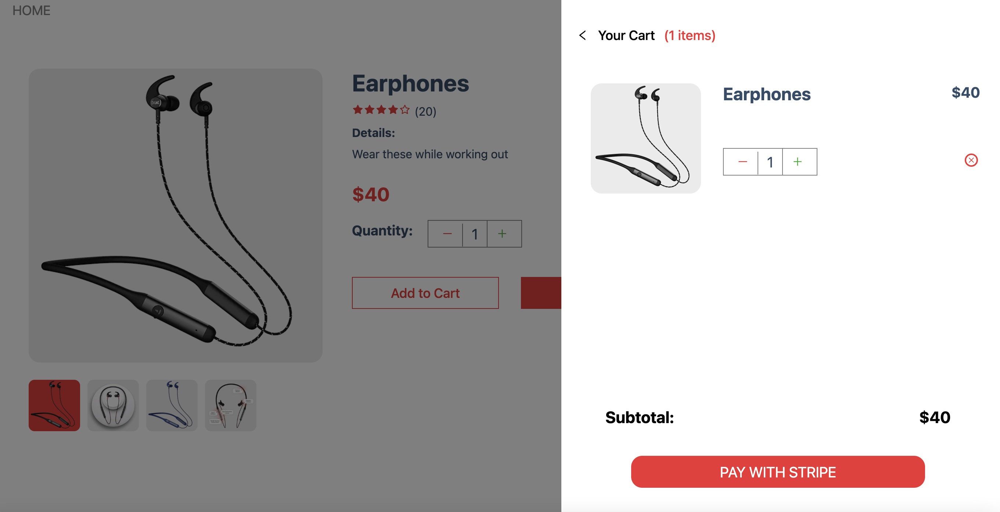
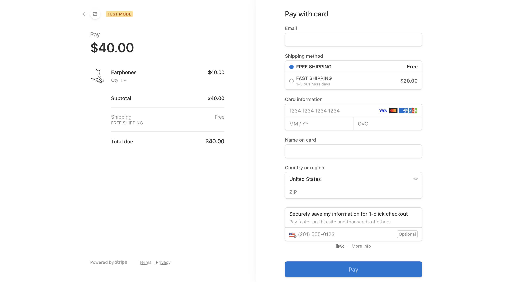

# Modern Full Stack ECommerce Application with Stripe & Sanity

[View demo](https://ecommerce-sanity-buiminh1995.vercel.app/)
## Description

This is a fully responsive full stack Ecommerce application with payments functionality. The application has
* Modern, responsive design and animations
* The ability to add and edit products using a Content Management System called [Sanity](https://www.sanity.io/), 
* Cart functionalities, and, 
* the integration with Stripe to cover real payments.

### Built With

* NextJS
* Javascript
* CSS
* [Sanity for CMS](https://www.sanity.io/)
* [Stripe which covers real payments](https://stripe.com/)

